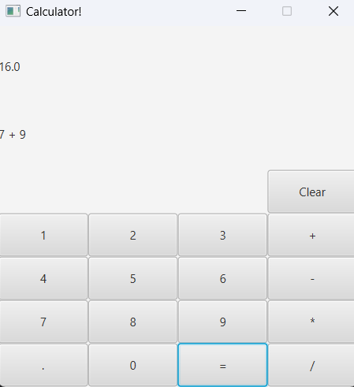

# JavaFX Calculator
This is a simple calculator application built using JavaFX. It performs basic arithmetic operations such as addition, subtraction, multiplication, and division.

## Features

- **User-friendly Interface**: The calculator has a clean and intuitive user interface, making it easy to use for performing arithmetic calculations.
- **Basic Operations**: Supports addition, subtraction, multiplication, and division operations.
- **Error Handling**: Handles division by zero and invalid input formats gracefully, displaying appropriate error messages to the user.

## Getting Started

### Prerequisites

- Java Development Kit (JDK) installed on your system.
- Apache Maven (optional, if you want to build the project using Maven).

### Running the Application

1. Clone this repository to your local machine:

    ```bash
    git clone https://github.com/Ayush272002/Simple-Calculator.git
    ```

2. Open the project in your favorite Java IDE (preferred IntelliJ IDEA).

3. Build and run the [`MainWindow`](calculator/src/main/java/com/calculator/calculator/MainWindow.java) class.

4. The calculator application window should appear, allowing you to perform arithmetic calculations using the provided buttons.

### UI

## Usage

- **Input**: Enter numbers and arithmetic operations using the buttons provided.
- **Operations**: Click on the appropriate operation buttons (`+`, `-`, `*`, `/`) to perform calculations.
- **Clear**: Click the "Clear" button to reset the calculator.
- **Error Handling**: If you input an invalid expression or attempt to divide by zero, an error message will be displayed.

## Contributors

- [Ayush Acharjya](https://github.com/Ayush272002)

## License

This project is licensed under the [MIT License](LICENSE).

